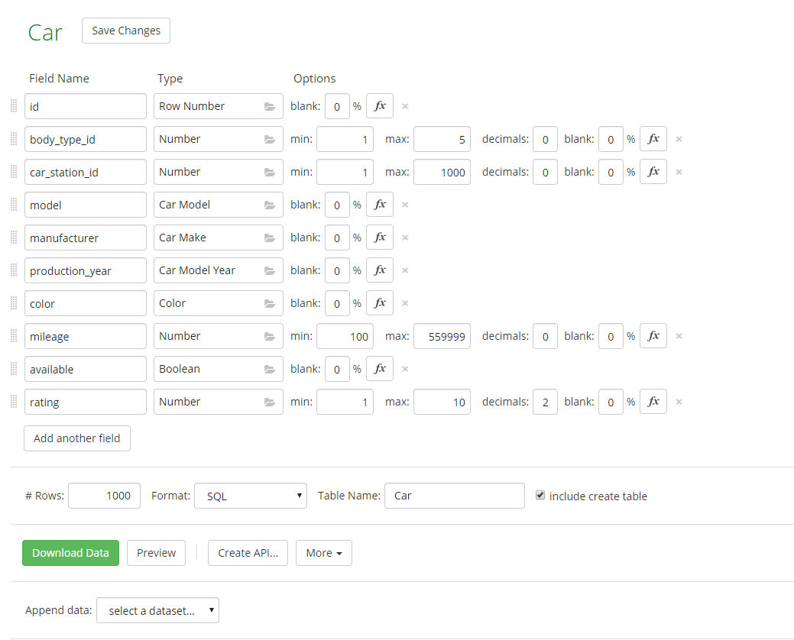

# Opis danych oraz źródła danych

Dane wypełniające utworzony schemat zostały wygenerowane za pomocą serwisu webowego [Mockaroo](https://www.mockaroo.com/). Na podstawie odpowiednich ustawień zostały wygenerowane transakcje w plikach SQL, które tworzą oraz wypełniają tabelę według schematu podczas uruchamiania kontenera dockerowego.

## Mockaroo

Serwis webowy udostępniający możliwość generowania plików `sql` z transakcją tworzącą tabelę zgodnie z podanym schematem a następnie wypełniającą tą tabelę zadeklarowaną liczbą wierszy. Narzędzie to udostępnia możliwość wybrania spośród tysiąca predefiniowanych typów kolumn począwszy od typów prostych aż po bardziej złożone, które z określonym kontekstem będą wypełniały dany wiersz. Np. wybranie typu `Country` spowoduje, że w nowo dodanym wierszu, wartość `country` zostanie wypołniona jedną z predefiniowanych wartości `Country`, np. Poland.

<figure class="image">
  
  <figcaption style="font-style:italic">Przykład definiowania schematu tabeli <b>CAR</b> </figcaption>
</figure>

Opcja pobrania pozwala nam na pobranie pliku, którego przykładowa zawartość prezentuje się następująco:

```sql
create table Car (
	id INT,
	body_type_id INT,
	car_station_id INT,
	model VARCHAR(50),
	manufacturer VARCHAR(50),
	production_year VARCHAR(50),
	color VARCHAR(50),
	mileage INT,
	available VARCHAR(50),
	rating DECIMAL(4,2)
);
insert into Car (id, body_type_id, car_station_id, model, manufacturer, production_year, color, mileage, available, rating) values (1, 1, 115, 'G-Series 1500', 'Chevrolet', 1996, 'Puce', 530764, false, 1.48);
insert into Car (id, body_type_id, car_station_id, model, manufacturer, production_year, color, mileage, available, rating) values (2, 3, 991, 'Grand Cherokee', 'Jeep', 2006, 'Green', 5030, false, 5.09);
...
...
...
```

## Opis danych

### ***Ilość danych***
Narzędzie [Mockaroo](https://www.mockaroo.com/) generuje powiązane z kontekstem dane do nowych wierszy. Dane te są różnorodne toteż rzadko się powtarzają się w różnych wierszach. Na przykładzie tabeli `Car`:
| Kolumna | Wierszy | Distinct |
| ------- | ------- | -------- |
| Model   | 1000    | 498      |
| Manufacturer | 1000 | 60     |
| Production_Year | 1000 | 43 |
| Color | 1000 | 19 |

Statystyka ta jest zachowana dla reszty tabel.

### ***Jakość danych***
Przykładowe wygenerowane wartości na przykładzie tabeli `Car`:
* **Model**: Savana 3500, A6, Pajero, Thunderbird, Aveo, Carens, Camry, Suburban 2500, Space  
* **Manufacturer**: GMC, Audi, Mazda, Ford, Chevrolet, Kia, Toyota, GMC, Isuzu, Maybach
* **Color**: Pink,  Blue, Red, Crimson, Red, Teal, Green, Indigo, Goldenrod, Blue

Jak widać dane są te zgodne z kontekstem kolumn, do których są przypisane. 

# Środowisko testowe
Środowisko testowe tworzone jest za pomocą kontenera Dockerowego. Korzystając z odpowiednio spreparowanego obrazu umieszonego na docker hub, ze skonfigurowanym Oracle Database 19.3 Enterprise Edition wraz z zależnościami na Oracle Linux. 

Środowisko uruchamiane jest z użyciem komendy docker-compose z użyciem konfiguracji zawartej w docker-compose.yml

------------------------ TUTAJ O KONFIGURACJI ----------------------------------


# Próbki obciążenia

------------------------ Tutaj o próbkach i skryptach ----------------------------


## Czasy transakcji
#### Transakcja 1
| Nr zapytania   | Minimalny czas[ms]| Maksymalny czas[ms]| Średni czas[ms]   | Ilość powtorzeń   |
| :------------: | :--------------:  | :----------------: | :---------------: | :---------------: |
| 1 | 0 | 0 | 0 | 0 |
| 2 | 0 | 0 | 0 | 0 |
| 3 | 0 | 0 | 0 | 0 |
| 4 | 0 | 0 | 0 | 0 |
| 5 | 0 | 0 | 0 | 0 |
| 6 | 0 | 0 | 0 | 0 |
| 7 | 0 | 0 | 0 | 0 |
| 8 | 0 | 0 | 0 | 0 |


#### Transakcja 2
| Nr zapytania   | Minimalny czas[ms]| Maksymalny czas[ms]| Średni czas[ms]   | Ilość powtorzeń   |
| :------------: | :--------------:  | :----------------: | :---------------: | :---------------: |
| 1 | 0 | 0 | 0 | 0 |
| 2 | 0 | 0 | 0 | 0 |
| 3 | 0 | 0 | 0 | 0 |
| 4 | 0 | 0 | 0 | 0 |
| 5 | 0 | 0 | 0 | 0 |
| 6 | 0 | 0 | 0 | 0 |
| 7 | 0 | 0 | 0 | 0 |
| 8 | 0 | 0 | 0 | 0 |

#### Transakcja 3
| Nr zapytania   | Minimalny czas[ms]| Maksymalny czas[ms]| Średni czas[ms]   | Ilość powtorzeń   |
| :------------: | :--------------:  | :----------------: | :---------------: | :---------------: |
| 1 | 0 | 0 | 0 | 0 |
| 2 | 0 | 0 | 0 | 0 |
| 3 | 0 | 0 | 0 | 0 |
| 4 | 0 | 0 | 0 | 0 |
| 5 | 0 | 0 | 0 | 0 |
| 6 | 0 | 0 | 0 | 0 |
| 7 | 0 | 0 | 0 | 0 |
| 8 | 0 | 0 | 0 | 0 |

## Wykonanie całych transakcji
| Nr zapytania   | Minimalny czas[ms]| Maksymalny czas[ms]| Średni czas[ms]   | Ilość powtorzeń   |
| :------------: | :--------------:  | :----------------: | :---------------: | :---------------: |
| 1 | 0 | 0 | 0 | 0 |
| 2 | 0 | 0 | 0 | 0 |
| 3 | 0 | 0 | 0 | 0 |