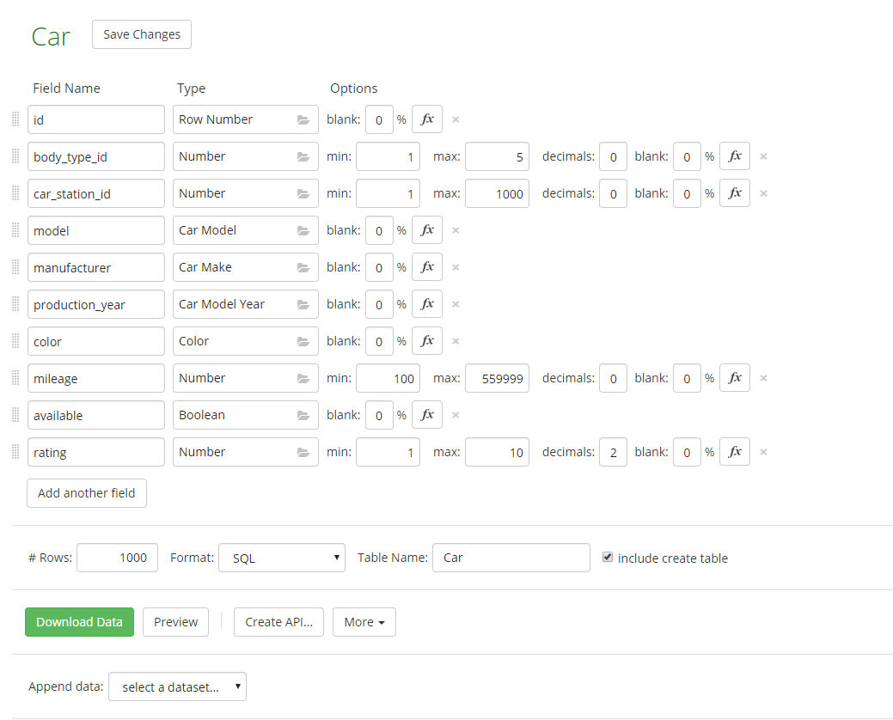

# Opis danych oraz źródła danych

## Dane

### Pochodzenie danych

Dane zostały wygenerowane za pomocą serwisu webowego [Mockaroo](https://www.mockaroo.com/).
Serwis pozwala na zdefiniowanie struktury tabel i wybranie typu dla każdego atrybutu.
Przykładowe typy: ```Numer, Kraj, Nazwa firmy, Imię, Nazwisko...``` 


<figure class="image">
  
  <figcaption style="font-style:italic">Przykład definiowania schematu tabeli <b>CAR</b> </figcaption>
</figure>


Zawartość wygenerowanych plików ma strukturę zaprezentowana poniżej:

```sql
create table Car (
	id INT,
	body_type_id INT,
	car_station_id INT,
	model VARCHAR(50),
	manufacturer VARCHAR(50),
	production_year VARCHAR(50),
	color VARCHAR(50),
	mileage INT,
	available VARCHAR(50),
	rating DECIMAL(4,2)
);
insert into Car (id, body_type_id, car_station_id, model, manufacturer, production_year, color, mileage, available, rating) values (1, 1, 115, 'G-Series 1500', 'Chevrolet', 1996, 'Puce', 530764, false, 1.48);
insert into Car (id, body_type_id, car_station_id, model, manufacturer, production_year, color, mileage, available, rating) values (2, 3, 991, 'Grand Cherokee', 'Jeep', 2006, 'Green', 5030, false, 5.09);
...
...
...
```

### ***Jakość danych***

#### Kontekst
Przykładowe wygenerowane wartości na przykładzie tabeli `Car`:
* **Model**: Savana 3500, A6, Pajero, Thunderbird, Aveo, Carens, Camry, Suburban 2500, Space  
* **Manufacturer**: GMC, Audi, Mazda, Ford, Chevrolet, Kia, Toyota, GMC, Isuzu, Maybach
* **Color**: Pink,  Blue, Red, Crimson, Red, Teal, Green, Indigo, Goldenrod, Blue

Wszystkie dane zostały wygenerowane tak, aby zgadzały się z kontekstem danego atrybutu.

#### Różnorodność
Wartości wygenerowanych danych są różnorodne. Na przykładzie tabeli `Car`:

| Kolumna | Wierszy | Unikalne |
| ------- | ------- | -------- |
| Model   | 1000    | 498      |
| Manufacturer | 1000 | 60     |
| Production_Year | 1000 | 43 |
| Color | 1000 | 19 |

Statystyka ta jest zachowana dla reszty tabel.

### ***Ilość danych***

| Tabela | Liczba wierszy |
| ------- | ------- |
| CAR | 206000 |
| CARBODYTYPE | 5 |
| CARSTATION | 201000 |
| COMPANY | 201000 |
| DAMAGE | 206000 |
| DAMAGESTATUS | 3 |
| DOCUMENTTYPE | 3 |
| INSPECTION | 201000 |
| INVOICE | 201000 |
| LOCATION | 201000 |
| PAYMENT | 201000 |
| PAYMENTSTATUS | 3 |
| PAYMENTTYPE | 2 |
| RENTALHISTORY | 201000 |
| STATIONWORKER | 201000 |
| SYSTEMUSER | 201000 |


# Środowisko testowe
Środowisko testowe tworzone jest za pomocą kontenera Dockerowego ze skonfigurowanym **Oracle Database 19.3 Enterprise Edition**.
Obraz jest przechowywany na prywatnym docker hubie.

Środowisko uruchamiane jest z użyciem komendy ```docker-compose up```, która opiera się na konfiguracji zawartej w docker-compose.yml

Proces uruchamiania środowiska wymaga trzech folderów:

* setup - pliki wewnątrz są uruchamiane przy pierwszym postawieniu dockera. Tworzy użytkownika oraz nadaje mu uprawnienia.

* manual - zawiera pliki ```transaction*.json``` z próbkami obciążenia (zapytania SQL)

* dump - zawiera plik ze zrzutem całej bazy danych (technologia Data Pump)

Po uruchomieniu kontenera dockerowego, wystarczy uruchomić skrypt ```python3 ./scripts/one_click_script.py```.
Działanie skryptu:
1. Połącz z bazą danych jako użytkownik ```USR``` (jeżeli się nie udało spróbuj ponownie X razy)
1. Uruchom benchmark dla każdego zestawu transakcji
    1. Usuń użytkownika ```USR``` z bazy danych kaskadowo (usuwa cały schemat ```USR``` wraz z danymi)
    1. Zaimportuj dane z pliku ```./dump/schema_dump.dmp``` (Data Pump)
    1. Sprawdź, czy dane zostały poprawnie zaimportowane (liczba wierszy w tabelach)
    1. Uruchom wszystkie polecenia SQL z plików ```./manual/transaction*.json``` X razy, wraz z mierzeniem czasu
    1. Wydrukuj wyniki pomiarów

# Próbki obciążenia

W pliku ```zapytania.md``` utworzono w jęzku naturalnym opis zapytań z podziałem na:
1. Operacje odczytu
    * niska, średnia, wysoka złożoność
1. Operacje modyfikacji
    * niska, średnia, wysoka złożoność
    
Następnie w pliku zapytania_2.md podzielono te zapytania na zestawy w taki sposób, 
aby każdy z nich zawierał podobną ilość zapytań o takim samym charakterze (odczyt/modyfikacja), 
o takiej samej złożoności (niska/średnia/wysoka) 
oraz o podobnym czasie wykonania.

## Czasy
#### Zestaw 1

| Minimalny czas[s]| Maksymalny czas[s]| Średni czas[s]   | Ilość powtorzeń   |
| :--------------:  | :----------------: | :---------------: | :---------------: |
| 0,719 | 1,019 | 0,825 | 10 |

| Nr zapytania   | Minimalny czas[ms]| Maksymalny czas[ms]| Średni czas[ms]   | Ilość powtorzeń   |
| :------------: | :--------------:  | :----------------: | :---------------: | :---------------: |
| 1 | 0 | 0 | 0 | 0 |
| 2 | 0 | 0 | 0 | 0 |
| 3 | 0 | 0 | 0 | 0 |
| 4 | 0 | 0 | 0 | 0 |
| 5 | 0 | 0 | 0 | 0 |
| 6 | 0 | 0 | 0 | 0 |
| 7 | 0 | 0 | 0 | 0 |
| 8 | 0 | 0 | 0 | 0 |


#### Zestaw 2

| Minimalny czas[s]| Maksymalny czas[s]| Średni czas[s]   | Ilość powtorzeń   |
| :--------------:  | :----------------: | :---------------: | :---------------: |
| 1,429 | 2,204 | 1,702 | 10 |

| Nr zapytania   | Minimalny czas[ms]| Maksymalny czas[ms]| Średni czas[ms]   | Ilość powtorzeń   |
| :------------: | :--------------:  | :----------------: | :---------------: | :---------------: |
| 1 | 0 | 0 | 0 | 0 |
| 2 | 0 | 0 | 0 | 0 |
| 3 | 0 | 0 | 0 | 0 |
| 4 | 0 | 0 | 0 | 0 |
| 5 | 0 | 0 | 0 | 0 |
| 6 | 0 | 0 | 0 | 0 |
| 7 | 0 | 0 | 0 | 0 |
| 8 | 0 | 0 | 0 | 0 |

#### Zestaw 3

| Minimalny czas[s]| Maksymalny czas[s]| Średni czas[s]   | Ilość powtorzeń   |
| :--------------:  | :----------------: | :---------------: | :---------------: |
| 0,789 | 1,099 | 0,952 | 10 |

| Nr zapytania   | Minimalny czas[ms]| Maksymalny czas[ms]| Średni czas[ms]   | Ilość powtorzeń   |
| :------------: | :--------------:  | :----------------: | :---------------: | :---------------: |
| 1 | 0 | 0 | 0 | 0 |
| 2 | 0 | 0 | 0 | 0 |
| 3 | 0 | 0 | 0 | 0 |
| 4 | 0 | 0 | 0 | 0 |
| 5 | 0 | 0 | 0 | 0 |
| 6 | 0 | 0 | 0 | 0 |
| 7 | 0 | 0 | 0 | 0 |
| 8 | 0 | 0 | 0 | 0 |

## Wykonanie całych zestawów
| Nr zapytania   | Minimalny czas[ms]| Maksymalny czas[ms]| Średni czas[ms]   | Ilość powtorzeń   |
| :------------: | :--------------:  | :----------------: | :---------------: | :---------------: |
| 1 | 0 | 0 | 0 | 0 |
| 2 | 0 | 0 | 0 | 0 |
| 3 | 0 | 0 | 0 | 0 |